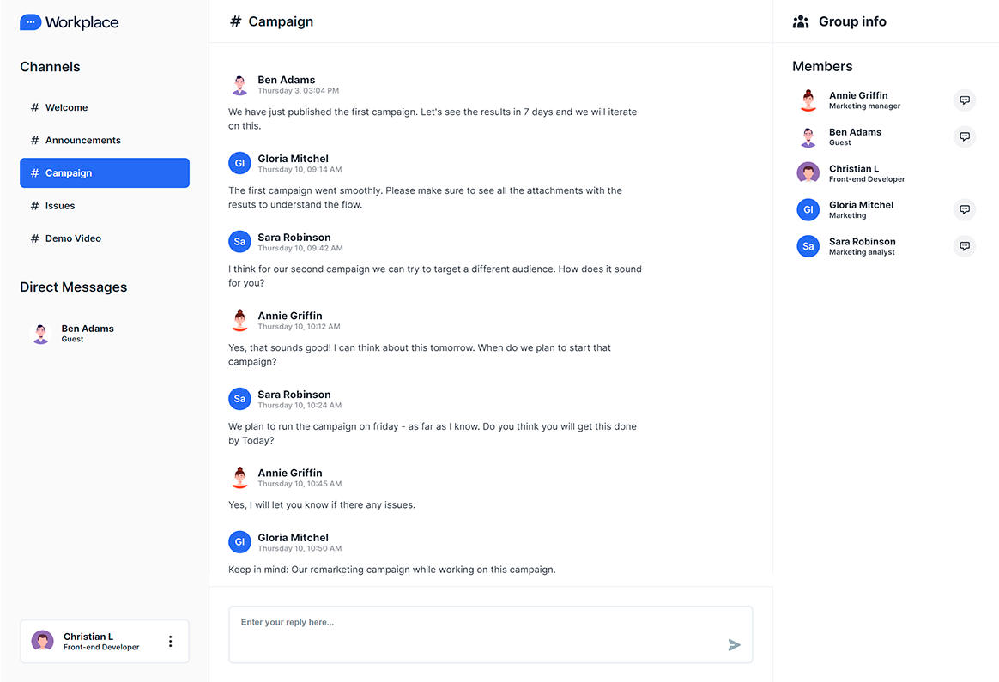

## Workplace

## Overview

The main goal was to create a simple and lightweight message communication platform. In the beginning, Workplace was designed for internal communication use only, but the ability to include anyone in the future was a feature that could bring an advantage for them, and that is why we decided to use a simple solution like Firebase authentication.

## Technology stack

- Javascript
- React
- Redux
- Style-components
- Firebase